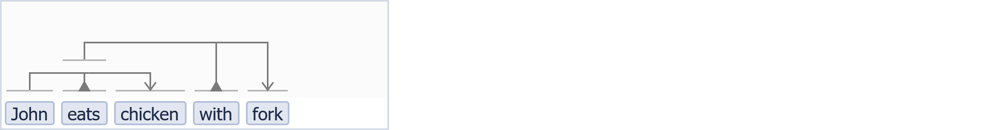
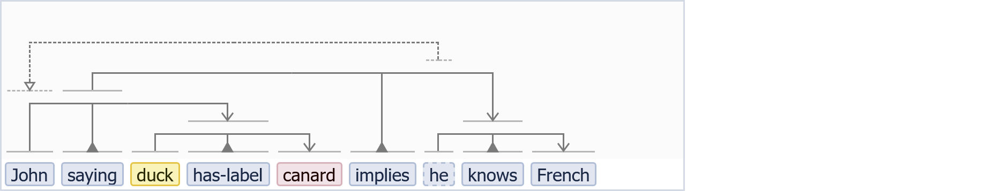
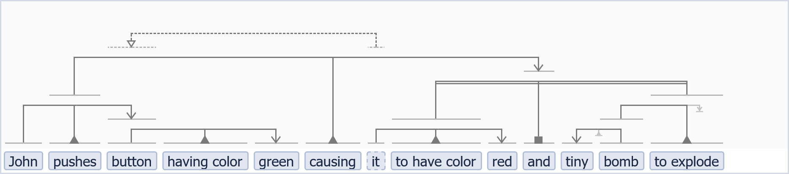

# vsm-to-rdf


## Overview

Converts VSM-JSON (=output emitted by a
[vsm-box](https://github.com/vsmjs/vsm-box) web-component) to
[RDF](https://www.w3.org/RDF/) [Turtle](https://www.w3.org/TR/turtle/) format.

Note that this module does not check for syntactic errors in the
VSM-JSON, so any validity checks are the responsibilty of external code.
<br>Still, the VSM-JSON is allowed to contain `null`s for class/inst/parentIDs
(as new terms created in a vsm-box always get `null` instIDs, to be filled in
only after getting a real one, e.g. after saving to a DB).
These will be replaced by dummy
[URI](https://en.wikipedia.org/wiki/Uniform_Resource_Identifier) IDs
in the RDF output.


## The VSM ontology: mapping VSM semantics to RDF

This module uses the VSM Ontology (VSMO) [to be created],
which provides '_primitive_ relations'
that define how VSM-connectors link VSM-terms together in an RDF-representation.

Note that in contrast, '_real_ relations' in a VSM-sentence are represented
not by Properties but by Classes/Instances in RDF.
This is similar to RDF's
[n-ary relations, pattern 1](https://www.w3.org/TR/swbp-n-aryRelations/#pattern1),
but:
1)  every relation is modeled by applying this n-ary pattern, iteratively, until
    only primitive relations like "has subject" and "has object" remain; and
2)  relations that in essence represent a primitive relation are not represented
    with redundant specificity, which means that e.g.
    "buying-action has-buyer X" is just modeled as
    "buying-action _has-subject_ X".

VSMO's small set of primitive relations (or _framework_-only relations)
make the semantics of VSM-connectors explicit in RDF.

VSMO's URIs have the prefix `http://www.w3.org/2019/vsmo/`,
which we will denote by `vsmo:`.

The text below elaborates some of VSM's semantics in detail, which is necessary
to correctly interpret the semantics of the corresponding RDF-representation.


### VSMO primitive relations

VSMO defines the following primitive relations, as Instances of
`rdf:Property`:
- For the trident VSM-connector:
  - `vsmo:has-agent`: represents the "has-subject" part in RDF, connecting the
    relation term to the subject term.<br>
    (Note that if the name "has-subject" would be used, it might lead to
    confusion with "rdf:subject", which is used in RDF reification (a different
    pattern to represent relations, distinct from the n-ary pattern)).
  - `vsmo:acts-on`: represents the "has-direct-object" part in RDF, connecting
    the relation term to the direct-object term.<br>
    (A similar note as above can be made regarding "rdf:object").<br>
    (Note also that although an alternative name "has-patient" could be used
    here (which is typically used together with "has-agent" elsewhere),
    the term "patient" might lead to confusion in VSM's first application
    domains: biology and medicine).
- For a list-connector:<br>
  this is represented in RDF with the primitive relations:
  - `vsmo:has-first-element`:
    which connects the VSM list-relation to its first list-element, and:
  - `vsmo:has-next-element`:
    which connects each list-element to the next one, creating an ordered
    sequence.
  - Note that the order in which list-elements appear in both VSM-JSON and RDF
    only carries 'real' meaning (i.e. has semantic relevance), when the
    list-relation assigns meaning to the order of its list-elements,
    as defined in the [spec](http://scicura.org/vsm/vsm.html#list-connector).
- For a coreference:<br>
  its RDF representation uses
  - `vsmo:has-parent`:
    which aims to model the connection of a 'child' VSM-term to
    a 'parent' VSM-term.
  - Note that, as defined in the
    [spec](http://scicura.org/vsm/vsm.html#coreference),
    a child and a parent VSM-term both represent the same 'thing' in the real
    world, but at different stages of 'explicit context' being attached to it.
  - Note: _explicit context_ = all the specificity in meaning
    that a VSM-Instance or VSM-RefInstance term receives through trident and
    list-relation connections (regardless of leg/role) with other VSM-terms.
    <br>For RefInstance terms, this comes in addition to (and may supersede
    meaning of):
    any other specificity in meaning that it receives from its parent VSM-term,
    (which receives its explicit context in the same way).
    <br>This comes again in addition to any prototype-descriptions that the
    Ref/Instance's parent VSM-Class may be linked to
    (e.g. "Duck(in general) sometimes quaks").
  - Note: _implicit context_ = all the not or not yet defined explicit context.
    This includes everything unsaid or unknown about it, and that also make this
    Ref/Instance a 'specific' thing or concept, plus everything that could ever
    still become knowable or explicitly stated about it.
    <br>A reasoning system could make use of this principle, by for example
    temporarily adding assumptions about the implicit context
    (temporarily modeled as explicit context), during a reasoning process.
    > (Note that this illustrates that the purpose of VSM is _not_ to model
      reality directly, but to support a 'thinking' process that aims to model
      reality and its unknowns, in an intuitive and expressive way).
  - Therefore, the meaning of `vsmo:has-parent` is: the copying of specifics or
    meaning that is captured in explicit context, from a parent onto a child.
  - Also therefore in RDF, the parent and child should not be merged into one
    node.
    > It remains to be investigated how this essential concept of VSM
      could be mapped precisely in terms of
      [BFO](https://en.wikipedia.org/wiki/Basic_Formal_Ontology).


### VSMO Classes

VSMO defines the following Classes, as Instances of `rdfs:Class`:
- `vsmo:ActiveRelation`:<br>
  Each term used as a relation in a VSM-sentence,
  is in RDF modeled by an Instance, which could be inferred to be instance
  of the ActiveRelation Class.
  - (Note that if we would just name this `vsmo:Relation`, it might lead to
    confusion with RDF's `rdf:Relation`).
- `vsmo:HasQuality`:<br>
  A relation-omitting bident's implicit relation is in RDF modeled by a
  blank node that is an instance of this class.
  <br>This class is a specialization of `vsmo:ActiveRelation`,
  as it plays the same role between a subject and an object term.


### Critical remarks ---
- On `vsmo:acts-on`:<br>
  - The name "acts-on" may be too specific, compared to just "has-patient"
    or "has-object".
    <br>For example "duck is-located-in pond" would be converted to
    "being-located has-subject duck' + 'being-located _acts-on_ pond",
    even though this relation expresses no real activity.
  - VSM is designed for use beyond the biosciences, which weakens an argument
    that the alternative name "has-patient" would lead to confusion in general.
- On `vsmo:has-agent`:<br>
  - "has-agent" is probably not the correct term for "has-subject".
    <br>Look at the example mentioned
    [here](https://en.wikipedia.org/wiki/Agent_(grammar)):
    "girl is-bitten-by dog".
    <br>While girl is the subject, _it is not the agent_.
    Instead _dog_ is the grammatical agent.
    <br>But in VSM, girl is the subject of this triple of terms,
    and must be assigned as such by a trident subject-leg.
    (So here, "is-bitten-by" is a passive relation, which has as semantic inverse
    the "bites" relation).
    <br>VSM connectors are designed to assign terms' _syntactic role_,
    from which semantics can be inferred.
    In a proper bridge between human and computer thinking,
    forcing people to think about a less intuitive "agent" meaning
    (which would only be reached after an extra step of thinking),
    would be poor design; especially when it can be automatically inferred.
    <br>Also, the existence of inverse relations that are both not-passive,
    like "precedes" and "follows", suggests that inverse-inference
    should be part of a suitable reasoner anyway.
- On `vsmo:HasQuality`:<br>
  - The 'implicit relation' of relationless bidents is meant to be used
    with more than just BFO-Quality terms.
    It can connect any two terms for which a particular relation
    can be inferred, as demonstrated in the
    [spec](http://scicura.org/vsm/vsm.html#bident-relationless).
    <br>Therefore it may be better to name it `vsmo:HasAttribute` instead.
  - In fact, no semantically 'real' HasAttribute (Active)relation is inserted
    by a relation-omitting bident, just like a trident does not insert a 'real'
    HasSubject/HasObject relation.
    <br>Therefore it might be more consistent to more closely preserve the
    original structure and instead model this with a `vsmo:has-attribute`
    primitive in RDF, that directly connects the subject to the object term.
    <br>And perhaps(?) this makes it simpler in RDF, to write rules that infer
    intended, explicit relations between subject and object, because the rules
    would not need to match an extra inserted HasAttribute blank node.
- On `vsmo:ActiveRelation`:<br>
  - This is probably a too specific name. For example "to-be-located-in"
    is not a real activity.
    <br>But, just using a name `vsmo:Relation` might lead to confusion
    with `rdf:Relation`.
    <br>So perhaps we could follow Hans Teijgeler's tentative approach
    and name it `vsmo:Relationship`.
- Furthermore:
  - All `has-` prefixes could be dropped for simplicity (as it is done for
    relations that support RDF reification).
    <br>So the proposal is to use: `vsmo:subject`, `vsmo:object`, etc.
  - Going this far already, why not simply dropping the `o` from `vsmo` as well?
    Then it becomes more fluent in conversations, when talking and making a
    distinction between `rdf:subject` versus `vsm:subject`, etc.
    And there is no `rdfo:`/`owlo:` with an `o` etc either.
  - Going further along this line, now `vsm:Relation` sounds justifiable again.
    <br>Because: it is a defining feature of VSM, that it treats entities
    and relations equally.
    So anyone using `vsm:`-terms properly would at least have to know that
    all real relations in VSM are modeled with RDF Classes,
    and only the few primitive ones as Properties.
- So the final proposal is:
  1)  to keep names simple in the VSM ontology:
      - `vsmo:has-agent` -> `vsm:subject`
      - `vsmo:acts-on` -> `vsm:object`
      - `vsmo:HasQuality` -> `vsm:attribute`
      - `vsmo:has-first-element` -> `vsm:first`
      - `vsmo:has-next-element` -> `vsm:next`
      - `vsmo:has-parent` -> `vsm:parent`
      - `vsmo:ActiveRelation` -> `vsm:Relation`
  2)  to include all the above reasons and critical remarks around
      possible other namings, as a permanent reference in this repository here
      (after some reformatting);
  3)  to recommend that people add the 'vsm:' prefix in their writings and
      conversations, when things might be confused with RDF or OWL.


## Specification of the conversion to RDF

### VSM-terms

#### Pre-processing of null-IDs

Note that:
- VSM-terms of the type VSM-Class, -Instance, or -RefInstance
  (note: these are not RDF types)
  have a `classID` property in the VSM-JSON;
- VSM-terms of the type VSM-Instance or -RefInstance
  have an `instID` property too;
- VSM-terms of the type VSM-RefInstance have a `parentID` property too.

Each of these IDs should be either a URI or `null` in the input VSM-JSON.

- For any `classID` or `instID` that is `null`: this module first generates
  a dummy URI.
- For any `parentID` that is `null`, for a term that _is not_ connected by a
  coreference as child term to a parent term: this module generates a dummy URI
  (which would represent a referred-to `instID` in some other VSM-sentence).
- For any `parentID` that is `null`, for a term that _is_ connected by a
  coreference as child term to a parent term (i.e. in the same VSM-sentence):
  this module makes this child term's `parentID` equal to the parent term's
  `instID` (which, if `null`, would be that parent's newly generated dummy URI).
- If a non-RefInstance term would erroneously not have a `parentID` but still be
  connected with a coreference as a child term to a parent term:
  this module first gives it all the extra IDs (`==null`) required to be a
  RefInstance term, and then handles it as above.


#### Generation of RDF

For each VSM-Instance or -RefInstance term, a line like this is added
to the output RDF:

`{instID} a {classID} .`

For VSM-Class or -Literal terms, no such line is added.

A VSM-Literal term is represented by the following fragment, wherever it occurs:
`"{literal-text}"^^xsd:string`.


### VSM-connectors

Here we show the RDF-representation of VSM-connectors. Note:
<br>&bull; the examples use `{Role-instID}` to represent a connected VSM-term,
because VSM-Ref/Instance terms (which have an instID) are the most common ones;
<br>&bull; for a connected VSM-Class term, this would be replaced
by `{Role-classID}`;
<br>&bull; for a connected VSM-Literal term, this would be replaced
by `"{literal-text}"^^xsd:string`.


#### Trident

A trident connects three VSM-terms and assigns to each either the Subject,
Relation, or Object role, relative to the other two.<br>
For each trident, a line like this is added:

`{Relation-instID} vsmo:has-agent {Subject-instID} ; vsmo:acts-on {Object-instID} .`

#### Object-omitting Bident

Bidents are just subtypes of the trident, with the same semantics.
<br>The object-omitting bident is used to model phrases with a verb that has
no object, like "device explodes". For these bidents, a line like this is added:

`{Relation-instID} vsmo:has-agent {Subject-instID} .`

#### Subject-omitting Bident

The subject-omitting bident models phrases where the subject is irrelevant or
not given, as in "destruction(-of) X", or "to-write book".
For these bidents, a line like this is added:

`{Relation-instID} vsmo:acts-on {Object-instID} .`

#### Relation-omitting Bident

The relation-omitting bident models an association between a Subject and
an Object term, whereby an implicit relation "HasQuality" is implied.<br>
For example, "white mouse" is mapped to "mouse HasQuality white".
(Note that a reasoner could infer a more specific "HasColor" from this, if
"white" is an instance of "Color" in its source ontology).<br>
For these bidents, a blank node is generated for the implicit relation (as it
has no identifier in the VSM-JSON), and a line like this is added:

```
[a vsmo:HasQuality] vsmo:has-agent {Subject-instID} ; vsmo:acts-on {Object-instID} .
```

#### List-connector

This connects a list-relation and N (>0) list-elements.
For a list-connector, a series of lines like this is added:

```
{ListRelation-instID} vsmo:has-first-element {ListElement-1-instID} .
{ListElement-1-instID} vsmo:has-next-element {ListElement-2-instID} .
...
{ListElement-(N-1)-instID} vsmo:has-next-element {ListElement-N-instID} .
```

#### Coreference connector

This connects a child term to a parent term, with semantics as described earlier.
For a coreference, a line like this is added:

```
{Child-instID} vsmo:has-parent {Parent-instID} .
```


## Example conversions

In the examples below, we use example URIs
for classes and example database identifiers for instances.<br>
(Tip: you can paste VSM-JSON in a textfield on
[scicura.org/vsm-box](http://scicura.org/vsm-box), and see/edit it
in a vsm-box).


### Simple example

The following piece of information is represented with just two tridents:

> John eats chicken with fork.

&bull; In a vsm-box (screenshot):



&bull; As VSM-JSON:
```
{
  terms: [
    { str: 'John',    classID: 'http://ont.ex/John',    instID: 'http://db.ex/00' },
    { str: 'eats',    classID: 'http://ont.ex/to-eat',  instID: 'http://db.ex/01' },
    { str: 'chicken', classID: 'http://ont.ex/chicken', instID: 'http://db.ex/02' },
    { str: 'with',    classID: 'http://ont.ex/to-use',  instID: 'http://db.ex/03' },
    { str: 'fork',    classID: 'http://ont.ex/fork',    instID: 'http://db.ex/04' }
  ],
  conns: [
    { type: 'T', pos: [ 0, 1, 2 ] },
    { type: 'T', pos: [ 1, 3, 4 ] }
  ]
}
```

&bull; As RDF Turtle:
```
PREFIX rdf: <http://www.w3.org/1999/02/22-rdf-syntax-ns#>
PREFIX vsmo: <http://www.w3.org/2019/vsmo/>

http://db.ex/00 a http://ont.ex/John .
http://db.ex/01 a http://ont.ex/to-eat .
http://db.ex/02 a http://ont.ex/chicken .
http://db.ex/03 a http://ont.ex/to-use .
http://db.ex/04 a http://ont.ex/fork .

http://db.ex/01 vsmo:has-agent http://db.ex/00 ; vsmo:acts-on http://db.ex/02 .
http://db.ex/03 vsmo:has-agent http://db.ex/01 ; vsmo:acts-on http://db.ex/04 .
```


### Example with the four VSM-term types, and some `null` IDs

> John saying that ducks (in general) are called 'canard' (as a label), implies that he (=John) knows French.

&bull; In a vsm-box (screenshot):



&bull; As VSM-JSON:
```
{ terms: [
    { str: 'John',      classID: 'http://ont.ex/John',          instID: null },
    { str: 'saying',    classID: 'http://ont.ex/to-say',        instID: null },
    { str: 'duck',      classID: 'http://ont.ex/duck'                        },  // Class
    { str: 'has-label', classID: 'http://ont.ex/to-have-label', instID: null },
    { str: 'canard'                                                          },  // Literal
    { str: 'implies',   classID: 'http://ont.ex/to-imply',      instID: null },
    { str: 'he',        classID: 'http://ont.ex/John',          instID: null, parentID: null },  // RefInstance
    { str: 'knows',     classID: 'http://ont.ex/to-know',       instID: null },
    { str: 'French',    classID: null,                          instID: null }   // =request to create new Class.
  ],
  conns: [
    { type: 'T', pos: [ 2, 3, 4 ] },
    { type: 'T', pos: [ 0, 1, 3 ] },
    { type: 'T', pos: [ 6, 7, 8 ] },
    { type: 'T', pos: [ 1, 5, 7 ] },
    { type: 'R', pos: [ 6, 0 ] }
  ]
}
```

&bull; As RDF Turtle:
```
PREFIX rdf: <http://www.w3.org/1999/02/22-rdf-syntax-ns#>
PREFIX xsd: <http://www.w3.org/2001/XMLSchema#> .
PREFIX vsmo: <http://www.w3.org/2019/vsmo/>

http://db.ex/00 a http://ont.ex/John .
http://db.ex/01 a http://ont.ex/to-say .
http://db.ex/02 a http://ont.ex/duck .
http://db.ex/03 a http://ont.ex/to-have-label .
http://db.ex/05 a http://ont.ex/to-imply .
http://db.ex/06 a http://ont.ex/John .
http://db.ex/07 a http://ont.ex/to-know .
http://db.ex/08 a http://x/08 .

http://db.ex/03 vsmo:has-agent http://db.ex/02 ; "canard"^^xsd:string .
http://db.ex/01 vsmo:has-agent http://db.ex/00 ; vsmo:acts-on http://db.ex/03 .
http://db.ex/07 vsmo:has-agent http://db.ex/06 ; vsmo:acts-on http://db.ex/08 .
http://db.ex/05 vsmo:has-agent http://db.ex/01 ; vsmo:acts-on http://db.ex/07 .
http://db.ex/06 vsmo:has-parent http://db.ex/00 .
```


## Example with all connectors

The following example contains several tridents, two types of bident,
a list connector, and a coreference connector:

> John pushes a green colored button, causing it to be colored red and a tiny bomb to explode.

&bull; In a vsm-box (screenshot):



&bull; As VSM-JSON:
```
{
  terms: [
    { str: 'John',          classID: 'http://ont.ex/John',          instID: 'http://db.ex/00' },
    { str: 'pushes',        classID: 'http://ont.ex/to-push',       instID: 'http://db.ex/01' },
    { str: 'button',        classID: 'http://ont.ex/button',        instID: 'http://db.ex/02' },
    { str: 'having color',  classID: 'http://ont.ex/to-have-color', instID: 'http://db.ex/03' },
    { str: 'green',         classID: 'http://ont.ex/green',         instID: 'http://db.ex/04' },
    { str: 'causing',       classID: 'http://ont.ex/to-cause',      instID: 'http://db.ex/05' },
    { str: 'it',            classID: 'http://ont.ex/button',        instID: 'http://db.ex/06', parentID: 'http://db.ex/02' },
    { str: 'to have color', classID: 'http://ont.ex/to-have-color', instID: 'http://db.ex/07' },
    { str: 'red',           classID: 'http://ont.ex/red',           instID: 'http://db.ex/08' },
    { str: 'and',           classID: 'http://ont.ex/and',           instID: 'http://db.ex/09' },
    { str: 'tiny',          classID: 'http://ont.ex/tiny',          instID: 'http://db.ex/10' },
    { str: 'bomb',          classID: 'http://ont.ex/bomb',          instID: 'http://db.ex/11' },
    { str: 'to explode',    classID: 'http://ont.ex/to-explode',    instID: 'http://db.ex/12' }
  ],
  conns: [
    { type: 'T', pos: [ 2, 3, 4 ] },
    { type: 'T', pos: [ 0, 1, 2 ] },
    { type: 'T', pos: [ 6, 7, 8 ] },
    { type: 'T', pos: [ 11, -1, 10 ] },
    { type: 'T', pos: [ 11, 12, -1 ] },
    { type: 'L', pos: [ 9, 7, 12 ] },
    { type: 'T', pos: [ 1, 5, 9 ] },
    { type: 'R', pos: [ 6, 2 ] }
  ]
}
```

&bull; As RDF Turtle:
```
PREFIX rdf: <http://www.w3.org/1999/02/22-rdf-syntax-ns#>
PREFIX vsmo: <http://www.w3.org/2019/vsmo/>

http://db.ex/00 a http://ont.ex/John .
http://db.ex/01 a http://ont.ex/to-push .
http://db.ex/02 a http://ont.ex/button .
http://db.ex/03 a http://ont.ex/to-have-color .
http://db.ex/04 a http://ont.ex/green .
http://db.ex/05 a http://ont.ex/to-cause .
http://db.ex/06 a http://ont.ex/button .
http://db.ex/07 a http://ont.ex/to-have-color .
http://db.ex/08 a http://ont.ex/red .
http://db.ex/09 a http://ont.ex/and .
http://db.ex/10 a http://ont.ex/tiny .
http://db.ex/11 a http://ont.ex/bomb .
http://db.ex/12 a http://ont.ex/to-explode .

http://db.ex/03 vsmo:has-agent http://db.ex/02 ; vsmo:acts-on http://db.ex/04 .
http://db.ex/01 vsmo:has-agent http://db.ex/00 ; vsmo:acts-on http://db.ex/02 .
http://db.ex/07 vsmo:has-agent http://db.ex/06 ; vsmo:acts-on http://db.ex/08 .
[a vsmo:HasQuality] vsmo:has-agent http://db.ex/11 ; vsmo:acts-on http://db.ex/10 .
http://db.ex/12 vsmo:has-agent http://db.ex/11 .
http://db.ex/05 vsmo:has-agent http://db.ex/01 ; vsmo:acts-on http://db.ex/09 .
http://db.ex/09 vsmo:has-first-element http://db.ex/07 .
http://db.ex/07 vsmo:has-next-element http://db.ex/12 .
http://db.ex/06 vsmo:has-parent http://db.ex/02 .
```
